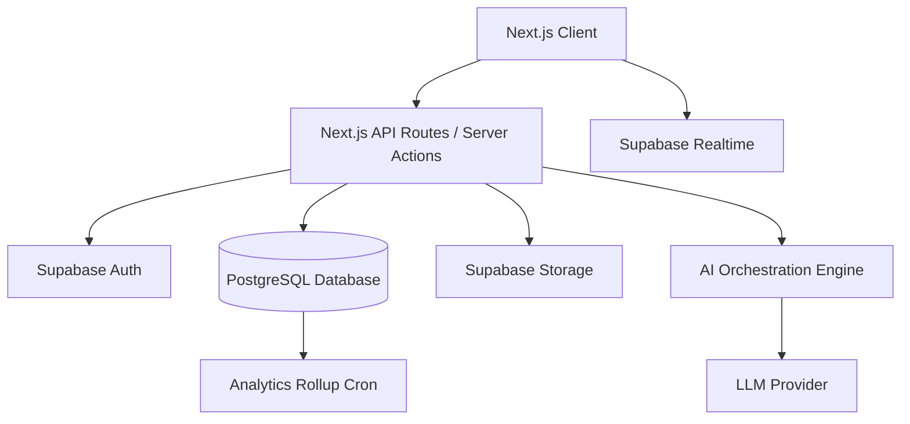

# Backend Architecture

## 1. Purpose
Provides a comprehensive overview of the MannMitra backend architecture, which supports the Next.js frontend, AI orchestration, real-time messaging, and secure data storage.

## 2. Scope
Covers the high-level infrastructure, service separation, and core technologies that power the MannMitra application backend.

## 3. Core Technologies
- **Compute**: Next.js App Router API Routes (Serverless Functions) deployed on Vercel/Node environment.
- **Database**: PostgreSQL (via Supabase) for relational data and vector storage (`pgvector` for AI embeddings).
- **Authentication**: Supabase Auth (GoTrue).
- **Storage**: Supabase Storage for audio recordings (voice notes) and images.
- **AI Integration**: OpenAI API (or Anthropic API) routed securely through backend edge functions.

## 4. Architecture Diagram

## 5. Service Responsibilities

### 5.1 Frontend API Layer (Server Actions)
- Handles business logic, form validation (Zod), and AI prompt construction.
- Never exposes internal database schemas directly to the client.

### 5.2 Database Layer (Supabase)
- Acts as the single source of truth.
- Implements Row Level Security (RLS) to enforce data privacy at the database kernel level, ensuring a compromised API route cannot leak cross-tenant data.

### 5.3 AI Orchestration Layer
- A dedicated module within the backend that intercepts user chat, runs safety classification, injects RAG context (student tasks/stress levels), and communicates with the external LLM provider.

## 6. Real-time Infrastructure
- Utilizes Supabase Realtime (WebSockets) for delivering instantaneous Mitra AI streaming responses and direct messaging between counsellors and students.

## 7. Security / Privacy
- **Stateless Authentication**: Uses short-lived JWTs.
- **No Direct DB Access**: The client application must not use the Supabase anon key to query sensitive tables directly; it must go through Server Actions to ensure audit logging and prompt sanitization.

## 8. Scalability
- **Serverless Compute**: Automatically scales with student traffic spikes (e.g., during exam weeks).
- **Connection Pooling**: PgBouncer (via Supabase) manages database connections to prevent exhaustion during peak load.

## 9. Related Documentation
- Reference `08-BACKEND/04-api-architecture.md` for API design patterns.
- Reference `08-BACKEND/07-rls-policies.md` for database security implementation.
