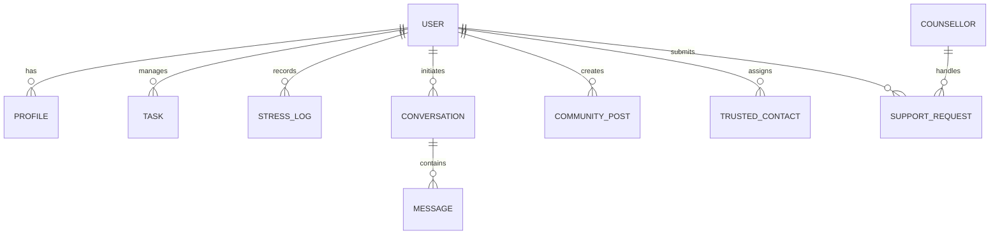

# Data Model

## 1. Purpose
To map the conceptual relationships between core business entities in MannMitra, moving from abstract product features to concrete backend relationships.

## 2. Scope
Covers the logical mapping of Students, AI Interactions, Planning, and Community.

## 3. Core Entity Relationships

## 4. Key Modeling Decisions

### 4.1 AI Memory vs. Structured Data
Mitra AI interactions generate both unstructured text (`MESSAGE`) and structured data (`TASK`, `STRESS_LOG`). 
- **Model**: The `MESSAGE` table contains an `extracted_task_id` foreign key. If an AI suggests a task and the user accepts it, the link is preserved so the system knows the provenance of the task.

### 4.2 Anonymity in the Community
To support true anonymity (Feature 22):
- **Model**: `COMMUNITY_POST` has an `author_id` mapping to `USER`, but it also has a `display_identity_type` enum (`REAL_NAME`, `ANONYMOUS`).
- **Safety**: The actual `author_id` is never returned to the client if the type is `ANONYMOUS`. It is resolved entirely at the database level using a secure View.

### 4.3 Longitudinal Analytics
To support the Stress Forecast (Feature 07):
- **Model**: `STRESS_LOG` captures point-in-time mood. `CALENDAR_EVENT` and `TASK` capture future pressure. The ML forecasting job joins these based on `student_id` and timestamps.

## 5. Data Requirements
- All user-generated content (posts, diary entries) must be modeled with foreign keys cascading securely. A user deleting their account must hard-delete their `PROFILE`, `DIARY`, and `STRESS_LOG`, while `COMMUNITY_POST` may be retained but strictly orphaned (author set to null) depending on institutional policy.

## 6. Testing
- Verify that cascading deletes work correctly to comply with GDPR/Data Privacy "Right to be Forgotten" mandates.
